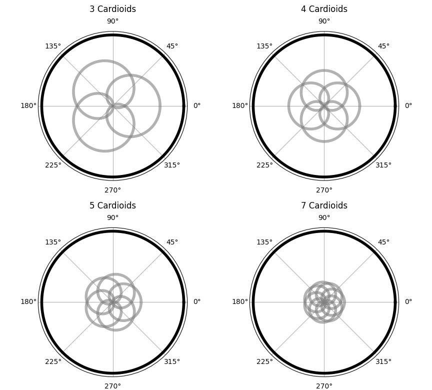
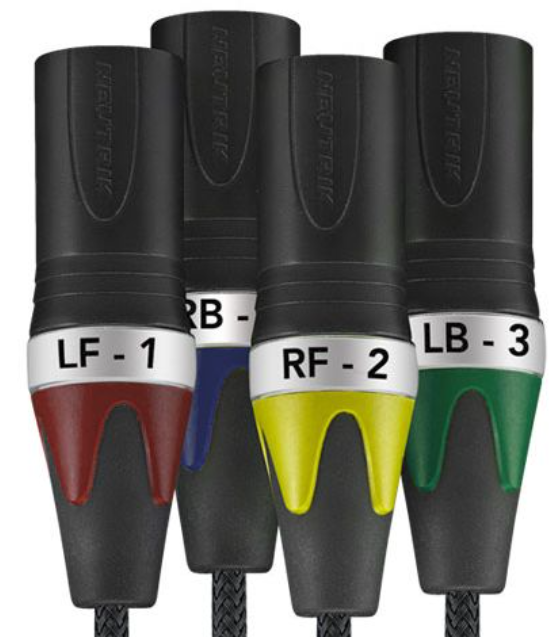
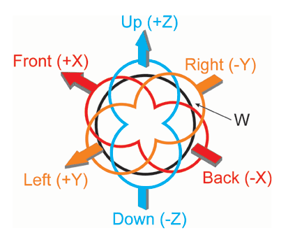
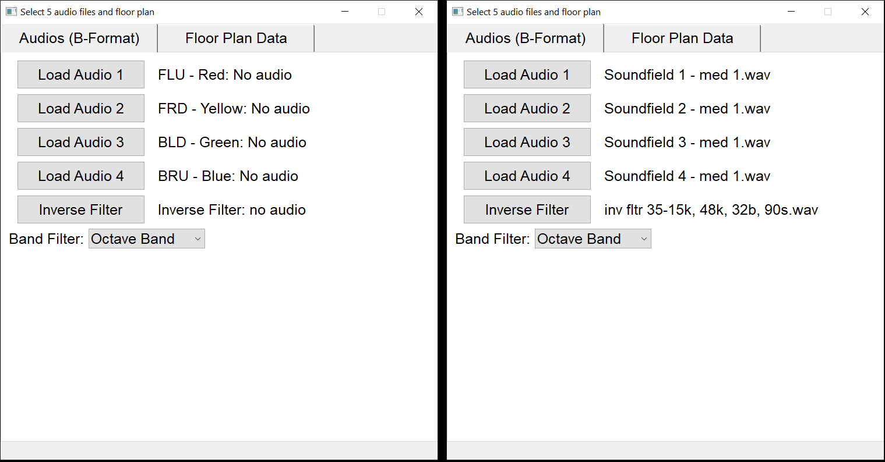

# 3D RIRs – Room Impulse Response Analysis in 3D

## Justification: What is an Ambisonics Microphone?

An Ambisonics microphone is an array of microphones capable not only of capturing the sound pressure level but also the direction of sound arrival. First-order Ambisonics (FOA) microphones consist of four cardioid capsules positioned at specific locations: Left-Front-Up (LF), Right-Front-Down (RF), Left-Back-Down (LB), and Right-Back-Up (RB). This configuration allows capturing a three-dimensional sound field that can be processed to obtain detailed spatial information.

In 2D it can be seen that the sum of cardioid microphones rotated 360°/n results in an omnidirectional microphone.

Below are the plots for n = 3, 4, 5, and 7 cardioid patterns, uniformly rotated around the circle. The gray curves represent the individual cardioid microphone responses, and the black curve shows their sum.

  

The same applies for a 3D pattern. 

## Program Overview

This software provides a graphical interface for the processing and visualization of Room Impulse Responses (RIRs) in 3D using first-order Ambisonics audio.

It allows the user to:
- Load four mono audio files corresponding to a sine sweep recorded with a first-order Ambisonics microphone (in A-format: FLU, FRD, BLD, BRU).
- Load the inverse filter for preprocessing the raw impulse responses.
- Load a floor plan image of the space under analysis.
- Input the room dimensions (width and length), as well as the microphone position within the space.
- Set the integration time (used for smoothing the energy and intensity curves).
- Set a direct sound threshold level in dB, relative to the maximum energy captured.

Upon processing, the software provides:
- Converts A-format audio (FLU, FRD, BLD, BRU) to B-format (W, X, Y, Z).
- Performs an analysis of the W channel.
  - Filtering by octave bands or third-octave bands.
  - Computes energy decay curves and integrates them using Schroeder's method.
  - Calculates  acoustic parameters (C50, C80, D50, D80, EDT, RT20, RT30, SNR, cT_ms, EDTt)
- Computes 3D acoustic intensity vectors, along with azimuth and elevation angles over time.
- Displays the trajectory of the acoustic intensity overlaid on the room layout image.
- Exports the results in tabular format for further analysis or documentation.
- Exports views of the 3D hedgehog plot.
- Provides an interactive 3D visualization with point annotations.

## Theoretical Background

This program performs 3D Room Impulse Response (RIR) analysis based on first-order Ambisonics (FOA) recordings, using a sine sweep and its inverse filter. The key processing steps are:

### 1. Impulse Response Extraction from Sine Sweep

The input consists of four mono audio recordings (A-format Ambisonics channels: **FLU**, **FRD**, **BLD**, **BRU**), each containing a sine sweep played and recorded in the room.

- The inverse filter of the sine sweep signal is loaded.
- Each recorded sweep is convolved with the inverse filter (via FFT convolution), resulting in an impulse response (IR) for each channel.
- The program detects the peak of the summed IR (across all four channels) and slices the IR signals to a fixed window (e.g., 1 second before and 9 seconds after the peak) to focus on the relevant acoustic response.
- The sliced IR signals are saved for further analysis or external use.

### 2. Conversion from A-format to B-format Ambisonics (WXYZ)

The four IR channels (FLU, FRD, BLD, BRU) are combined linearly to obtain the first-order B-format channels **W, X, Y, Z** using the following formulas:

<pre>
W = FLU + BLD + FRD + BRU (omnidirectional) 
X = FLU - BLD + FRD - BRU (back-front) 
Y = FLU + BLD - FRD - BRU (rigth-left) 
Z = FLU - BLD - FRD + BRU (down-up)
</pre>

An ambisonics connector can be seen in the following picture:

  

This transformation enables spatial analysis of the sound field following standard Ambisonics conventions.

The conversión outputs the following:

  

### 3. Acoustic Intensity Calculation

From the B-format channels, the acoustic intensity vector is computed as follows:

- A low-pass filter (cutoff ≈ 5 kHz) is applied to the W, X, Y, Z signals to remove high-frequency noise. This is a limitation of this kind of microphone array.
- The acoustic intensity components along each axis are obtained by multiplying the omnidirectional pressure channel **W** with each directional channel:

\[
I_x = \text{smoothed}(W \times X), \quad
I_y = \text{smoothed}(W \times Y), \quad
I_z = \text{smoothed}(W \times Z)
\]

- Smoothing is performed using a Hamming window over a user-defined integration time to reduce fluctuations.
- The intensity magnitude \(I\) is calculated as the Euclidean norm:

\[
I = \sqrt{I_x^2 + I_y^2 + I_z^2}
\]

- Azimuth (\(\theta\)) and elevation (\(\phi\)) angles of the intensity vector are calculated via:

\[
\theta = \arctan2(I_y, I_x), \quad
\phi = \arcsin\left(\frac{I_z}{I}\right)
\]

These angles describe the direction of the energy flow in 3D space.
- The intensity magnitude and angles are truncated to a 10-second window centered around the maximum intensity peak to focus on the direct sound and early reflections.

### 4. Peak Detection on Intensity Envelope

- Peaks in the acoustic intensity magnitude are detected to identify significant acoustic events (e.g., reflections).
- The time axis is recalibrated relative to the first detected peak, enabling consistent temporal reference for further analysis.

The program prompts the user to input the path to the audio files.
For clarity, the expected filenames are specified, as well as the usual wire colors associated with each channel on the microphone connector (following typical manufacturer conventions).

  

Floor plan tab
The user must provide:

The path to the floor plan image (.jpg format),

The dimensions of the room (in meters),

The location of the measurement microphone within the floor plan.

Additionally, this section includes a menu to configure:

The integration time for the energy decay calculation,

The threshold value (in dB) used to filter out signals that are significantly lower than the direct sound (to exclude noise or reflections of low intensity).

